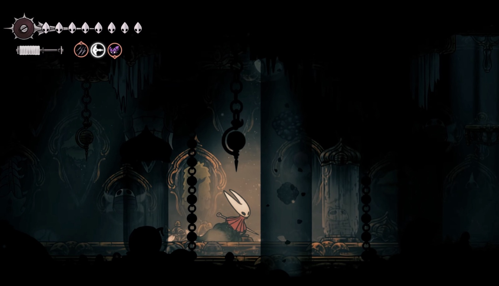

# Memorium


### Your work, remembered.


_Named after the [Memorium](https://www.hollowknight.wiki/w/Memorium) from Silksong, a place built to remember the species of certain regions. This place remembers you._


## Overview
Memorium turns your agent sessions, PRs, and meetings into a private, linked record of your work: what you shipped, how you work, and what slows you down. It's a small kit: three agent skills, some scripts, and an Obsidian vault template. Your agent does the setup.


## What you get

Run `/worklog` once a week. It reads every agent session and PR from last week, then writes:

- **Week notes:** what you did, by topic, with PR links.
- **Efforts:** long projects that grow a timeline across the year, so the big story shows, not only the pieces.
- **Achievements:** wins sized major, notable, or routine, with evidence, ready for your year-end review.
- **How I Work:** patterns in how you work, backed by your own quotes.
- **Strengths and Struggles:** each struggle has a status, so you can watch it change.
- **People:** who you mentor, unblock, and review for.
- **Friction, sorted by fix:** what tripped you or your agent up, and whether the fix is a skill, an AGENTS.md line, a doc PR, or tooling.
- **By the Numbers:** prompts, active hours, after-hours work, PRs, time to merge, and reviews per person, saved every week for charts at year end.

Two more skills round it out:

- `/meeting` turns a meeting transcript into a note that leads with your role.
- `/topic` keeps a private brief about a subject, built from a repo plus transcripts, that you can ask questions against.

## Two repos

Memorium uses two repos, and they never mix:

| | Memorium (this repo) | Your notes |
| --- | --- | --- |
| What | The kit: skills, scripts, vault template | Your vault: everything written about you |
| Where | Cloned to `~/dev/memorium` | Created at `~/notes` from `vault-template/` |
| Visibility | Shared | **Always private** |
| You | Pull updates. Push generic improvements | Commit often. It's your backup |

Setup creates the notes repo for you with `gh repo create <you>/notes --private`. It's a fresh repo with no git link back to Memorium. Never put notes in your Memorium clone, and never copy anything from your notes into Memorium.

## Set up (about 10 minutes)

1. Clone this repo: `gh repo clone <owner>/memorium ~/dev/memorium`
2. Start an agent session in your home folder.
3. Paste [`BOOTSTRAP.md`](BOOTSTRAP.md) into it.

The agent interviews you, installs Obsidian and its CLI, creates your vault from `vault-template/` as a new private repo, links the skills, and runs a test week with you.

## What's in the kit

```
skills/
  worklog/     SKILL.md, EXTRACT.md (the brief each subagent gets), scripts/
  meeting/     SKILL.md, scripts/clean.py
  topic/       SKILL.md
vault-template/
  AGENTS.md    vault rules for agents
  Home.md      your one-screen overview
  About Me/    How I Work, Strengths, Struggles, By the Numbers
  _meta/       profile.md, people.md, Fixes.md, Worklog Changelog.md
  .obsidian/   graph colors, bookmarks, plugin settings
BOOTSTRAP.md   the setup prompt
```

## Sensible defaults, not rules

The folders, note names, and sections are a starting point. Rename, drop, or add what you like. Update the table in your vault's `AGENTS.md` and the skills follow it. Some people keep a `Learnings/` folder or topic hubs for things they're studying. Use what helps.

## Sources

| Source | Status |
| --- | --- |
| OpenCode, Pi, Claude Code sessions | Built in |
| GitHub PRs you wrote and reviewed | Built in, through `gh` |
| Meeting transcripts | Through `/meeting` |
| Confluence pages you wrote | Optional, set in `profile.md` |
| Jira | Optional |
| Codex, Cursor, Gemini CLI, and others | Add a reader. The bootstrap helps, and `sessions.py` explains how |

## Your profile

`_meta/profile.md` in your vault tells the skills who you are: role, efforts, people, values, credit notes, and which sources are on. The skills read it, so the kit itself holds nothing about you. Edit it any time. The more context it has, the better the findings.

## Keeping the kit and your vault apart

- Personal details live only in your vault.
- The skills are symlinks into your clone of this repo. When you improve a skill, you're editing the kit. Write the change generically, then commit and push it here.
- A skill that only fits you stays in your own skills folder.
- Pull the kit to get others' improvements.

## Limits

- Built for macOS (Homebrew, Keychain, `pbpaste`).
- Claude Code deletes transcripts after 30 days unless you change `cleanupPeriodDays`. Setup offers to.
- A big backfill reads a lot of sessions, and costs agent time accordingly. It runs one month at a time.
- The friction and sizing guidance leans toward engineering work. Designers get value too, and can tune `EXTRACT.md` for their work.

## Tips

- **Saving long secrets:** `security add-generic-password -w` with a prompt cuts input at 128 characters. Save long tokens with `-w "$(pbpaste)"` instead.
- **Screenshots in agent chats:** dragging the macOS floating thumbnail hands over a temp file that disappears at once. Copy to the clipboard (Cmd+Ctrl+Shift+4) and paste instead.
